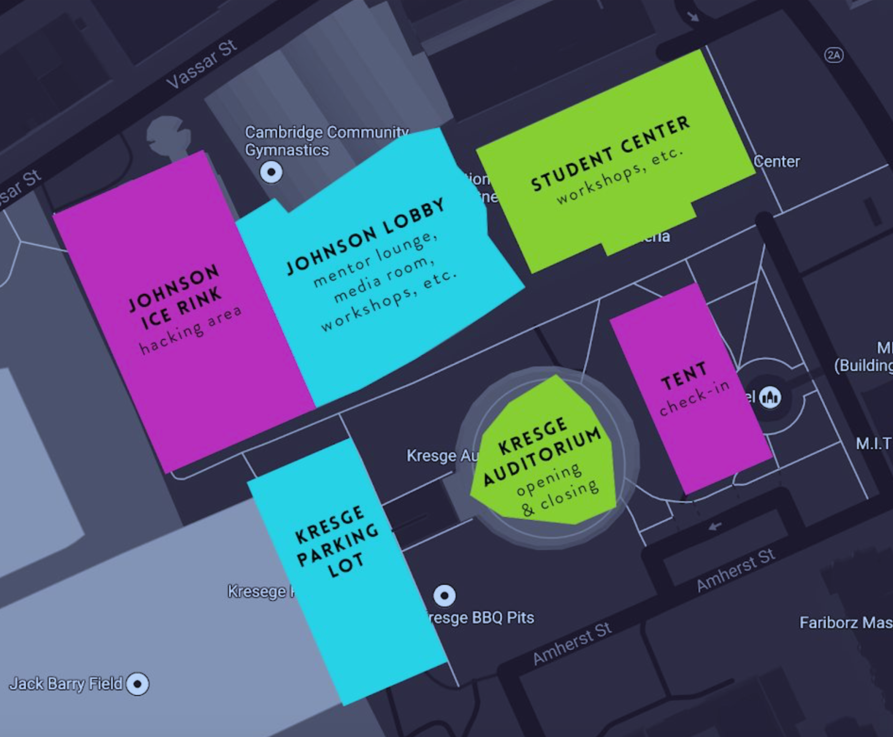

# HackMIT guide

## Important deets
**Wear Microsoft branded gear please!** 

Key times:

**Saturday**
- 8am - Meet at sponsor checkin @ white tents outside of [Kresge Auditorium](https://www.google.com/maps/place/Kresge+Auditorium/@42.3577976,-71.1011636,15z/data=!4m8!1m2!2m1!1skresge+auditorium!3m4!1s0x89e37a007a8bbfe5:0x1571262b039a43bd!8m2!3d42.3581353!4d-71.0950313)
- 11am - Mentor orientation in Johnson Media Room
- 11am-2pm - **Key hack time**. Students will need the most help getting up and running with Azure (and convinced to use Azure)
- 5pm - Our tech talk (Shana will be AWOL)

**Sunday**
 8am and on - **Key hack time**. Last minute hack help/Azure tech support
- 11am - Expo judging (Morgan and Chander)
- 1pm - Azure prize judging (Morgan, Chander, Jasmine)
- 3pm - Closing ceremonies/tear down/help Shana ship stuff back

Where:

 

## Contact info
### Shana - main POC: 
- phone: 206-434-6193
- mail: shanama@microsoft.com

| Name               | Title                    |  Role at the event                            | Contact info |
| ------------------ | ------------------------ | --------------------------------------------- | ------------ |
| Shana Matthews     | PM student dev           | Event + Technical mentor + Technical workshop | 206-434-6193 |
| Cristina Brendicke | PMM student dev          | Event coordination + Business mentor          | 206-303-7907 |
| Morgan Mitchell    | PMM student dev          | Technical mentor + Azure judge + event judge  | 435-901-1928 |
| Jasmine Greenaway  | Cloud Developer Advocate | Technical mentor + Azure judge                | 646-220-3858 |
| Chander Dhall      | MVP                      | Technical mentor + Azure judge + event judge  | 214-801-6705 |
| Lance McCarthy     | MVP                      | Technical mentor                              | 617-595-3686 |
| Kushan Perera      | MVP                      | Technical mentor                              | 929-525-7949 |

## Schedule
[Most up-to-date schedule](http://go.hackmit.org/sponsor-schedule) run by HackMIT staff

[dayof website](http://go.hackmit.org/dayof) run by HackMIT staff

### Booth schedule
It's always a good idea to be around at the booth, but if you're listed as the "booth owner" please make sure you're there to keep things running and field questions!

| Time               | Booth owner                                           | 
| ------------------ | ----------------------------------------------------- |
| **Saturday**       |                                                       |
| 11am - 2pm         | **All please!!**                                      |
| 2pm - 4pm          | Jasmine                                               |
| 4pm - 6pm          | Cristina, Lance                                       |
| 6pm - 8pm          | Morgan                                                |
| 8pm - 10pm         | Cristina                                              |
| 10pm on            | N/A (or just Shana)                                   |
| **Sunday**         |                                                       |
| 8am - 11am         | **All please!!**                                      |
| 11am               | All hands on deck for judging                         |
| 3pm and on         | Help Shana tear down booth & ship out booth materials |  

## Booth talking points
- Apply for a job at Microsoft (expect a LOT of interest in this)
   - Apply for internship or fulltime jobs at careers.microsoft.com
   - Online applications only, we do not accept paper resumes.
   - Refer recruiting questions to University recruiting or Microsoft full time employees.
- Free Azure through Azure for Students
   - Activate here: [Azure for Students](https://aka.ms/a4s)
   - No credit card required
   - $100 Azure credits, must prove you are a student by signing up with your student email address
   - If student email address is not recognized as a student, Shana has Student verification codes student can use as proof of student status
   - If verification code does not work, Shana has Azure passes student can activate
- Enter to win Azure API prize
   - Use Azure in your hackathon and qualify for Azure API prize
   - Prize is 4 Xbox One S 1TB
   - Find tutorials to learn Azure at docs.microsoft.com or at our 5pm workshop
   - Judging criteria:
     | Criteria | Points |
     | -------- | ------ |
     | Does the project address a clear need, problem, or opportunity and is the solution clearly explained? | /10 |
     | Does the project include innovations in technical design and/or implementation of services (e.g., Cognitive Services, Machine Learning) and/or User Experience? | /20 |
     | Does the project have a clear target market or audience? | /5 |
     | Is the project’s purpose and basic functionality easily understood? | /5 |
     | Does the project have a professional degree of production in terms of performance, user interface, visuals, and audio? | /10 |
     More info below.

## Social media guidelines
[Read me and learn how to Tweet/Facebook!](../socialguidance.pdf)

## Being a mentor
**How do I talk to hackers?​** 

Sometimes hackers may be a little shy about approaching company reps, so feel free to walk around the hacking area and introduce yourself, ask them what they’re working on, and offer your expertise! We’ll also be using a mentor queue to match mentors to hackers.

**Mentor queue?**​ ​

This will be our live ticketing system during the event. Whenever hackers need help, they can post a ticket descrbing their issue and their location, and then mentors will be able to claim the tickets and come to the rescue! We highly recommend that mentors should attend a quick orientation (see schedule) to use the queue most effectively. If the mentors cannot attend, then they can access the queue at ​go.hackmit.org/q​— they can ask an attendant at the help desk for mentor privileges and a brief description of how to use it effectively.

[Mentor guide + map](hackmit_mentorguide.pdf)

## Being a judge
2 judging opportunities
1. HackMIT event judge for expo @ 11am Sunday
1. Azure judge @ 1pm Sunday

[Judging criteria for Azure prize](../hackjudging.png)

## Info on Azure student programs
[Azure for Students](https://aka.ms/a4s)

[Microsoft Student Partner program](https://imagine.microsoft.com/en-us/msp)

[Imagine Cup](https://imaginecup.microsoft.com/en-us/Events?id=0)

## Other FAQ
What if someone asks me to sponsor their hackathon/event?

Point them here: [aka.ms/event-sponsor-request](https://aka.ms/event-sponsor-request)

[Briefing deck](hackmit_briefingdeck.pdf)

